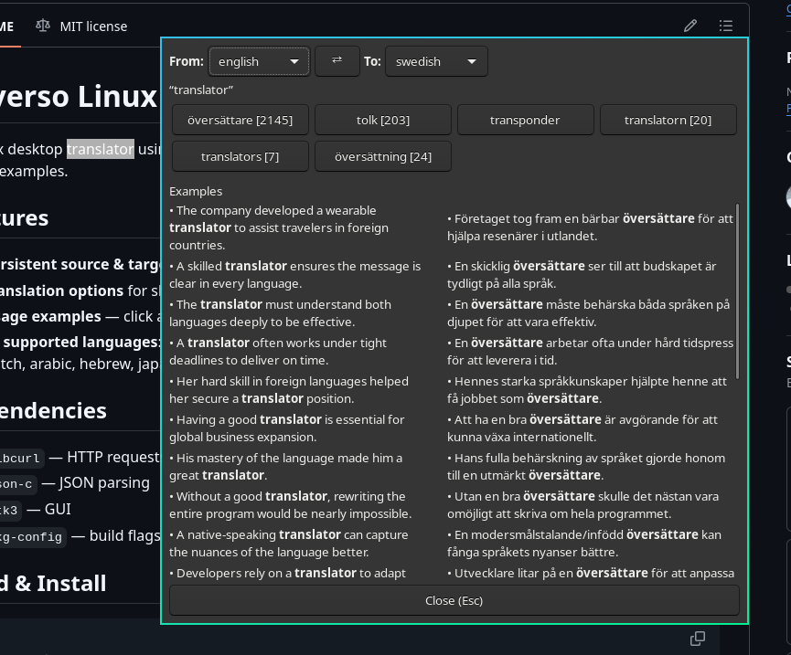

# Reverso Linux

A Linux desktop translator using the [Reverso](https://www.reverso.net) translation API. Select text, press a hotkey, get translations with usage examples.



## Features

- **Persistent source & target language** — saved to `~/.config/reverso-linux/config`
- **Translation options** for short text (1–3 words) with frequency counts
- **Usage examples** — click a translation option to see sentence examples side by side
- **16 supported languages**: english, russian, ukrainian, french, german, spanish, italian, portuguese, polish, dutch, arabic, hebrew, japanese, turkish, chinese, romanian, swedish

## Dependencies

- `libcurl` — HTTP requests
- `json-c` — JSON parsing
- `gtk3` — GUI
- `pkg-config` — build flags

## Build & Install

```sh
make
sudo make install
```

## Usage

### CLI

```sh
reverso-linux hello world             # translate from stdin
wl-paste -p | reverso-linux           # pipe from clipboard, wl-paste is part of wl-clipboard
reverso-linux -t french hello world   # set target language
reverso-linux -h                      # help
reverso-linux -v                      # version
```

### Compositor keybinding (Hyprland)

Add to `~/.config/hypr/hyprland.conf`:

```
bind = SUPER, R, exec, wl-paste -p | reverso-linux
```

Press **Win+R** to translate the current clipboard selection.
